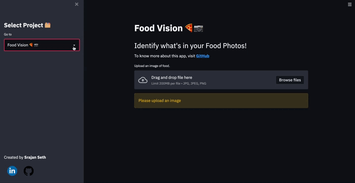

# All ML Projects (Streamlit)

All ML Projects contains 5 Projects (Click to view Original Repo):

* [Neural Style Transfer](https://github.com/srajanseth84/Neural-Style-Transfer)
* [Food Vision](https://github.com/srajanseth84/Food-Vision)
* [Fill the Gap (FTG)](https://github.com/srajanseth84/FTG)
* [Text Generator](https://github.com/srajanseth84/Text-Generator-using-GPT2)
* [Sentiment Classification](https://github.com/srajanseth84/Sentiment-Classification)


## [View Deployed Demo on Streamlit](https://share.streamlit.io/srajanseth84/all-ml-projects-streamlit/main/app.py)
- Just Select the Project you want to checkout


## Demo




## Run Locally

* Clone the project

```bash
  git clone https://github.com/srajanseth84/All-ML-Projects-Streamlit.git
```

* Go to the project directory

```bash
  cd All-ML-Projects-Streamlit
```
* Create venv

```bash
  python3 -m virtualenv venv 
```

* Activate the venv

```bash
  source venv/bin/activate
```

* Install dependencies

```bash
  pip install -r requirements.txt
```
* Add your API TOKEN of Hugging face from [Hugging Face 🤗](https://huggingface.co/) in Sentiment_Classification/sentiment_classification.py


* Start the server

```bash
  streamlit run app.py 
```

## Tech Stack
* **Front-End**: [Streamlit](https://github.com/streamlit/streamlit)
* **Cloud**: [Streamlit Cloud](https://streamlit.io/cloud)
* **DL-Framework**: [Tensorflow](https://github.com/tensorflow/tensorflow), [Hugging Face](https://huggingface.co/)


## Reference

- [Hugging Face 🤗](https://huggingface.co/)
- [Tensorflow](https://github.com/tensorflow/tensorflow)

## Author

- [@srajanseth84](https://github.com/srajanseth84)